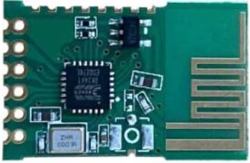

<p align="center">
  
</p>
<h1 align="center">JDY-41</h1>
<h2 align="center">Minimalistic CLI tool for module configuration</h2>

[](https://vshymanskyy.github.io/StandWithUkraine/)

## Why?
Configuration of <a href="./docs/jdy-41-manual.pdf">JDY-41</a> may be pretty challenging and requires special software for accessing the serial port. The purpose of this tool is to simplify and speed up the configuration process.

## Installation
1. Clone or download the repository
2. Install dependencies via `npm i`

## Instructions
- `reset` 
- `read-device-id`
- `read-version-number`
- `read-parameters` 
- `configure-parameters`
- `configure-device-id`
- `send-address-message`

## Features
- Automatic serial port detection
- Resending the instruction if no response is received
- No need to provide instruction's head and terminator

## Usage
```
npm start configure-parameters 04 00 09 A0 66 77 88 55 01 00
```
## Parameters format
|Baud rate|Channel|Power|Mode|Wireless ID|Response|Backup|
|---------|-------|-----|----|-----------|--------|------|
|04       |00     |09   |A0  |66 77 88 55|01      |00    |

### Baud rate 
|Value|Baud |
|-----|-----|
|01   |1200 |
|02   |2400 |
|03   |4800 |
|04   |9600 |
|05   |19200|
|06   |38400|

### Channel
Channel range is **0-127**

### Power
|Value|Power|
|-----|-----|
|01   |-25db|
|02   |-15db|
|03   |-5db |
|04   |0db  |
|05   |+3db |
|06   |+6db |
|07   |+9db |
|08   |+10db|
|09   |+12db|

### Mode
|Value|Mode|
|-----|----|
|A0   |Serial port transparent transmission
|C0   |Remote control transmitter (With LED indicator)
|C1   |Remote control transmitter
|C2   |Non learning remote control receiving or switch value receiving (IO level synchronization)
|C3   |Non learning remote control receiving (Level reversal)
|C4   |Non learning remote control receiving (Pulse level)
|C5   |Learning remote control receiving (IO level synchronization)
|C6   |Learning remote control receiving (Level reversal, Pulse level)
|C7   |Learning remote control receiving (Pulse level)

### Wireless ID
Range is **00000000-FFFFFFFF**

### Response
|Value|Response|
|-----|--------|
|00   |No response to data transmission
|01   |Response to data transmission

### Backup
No function
