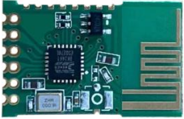
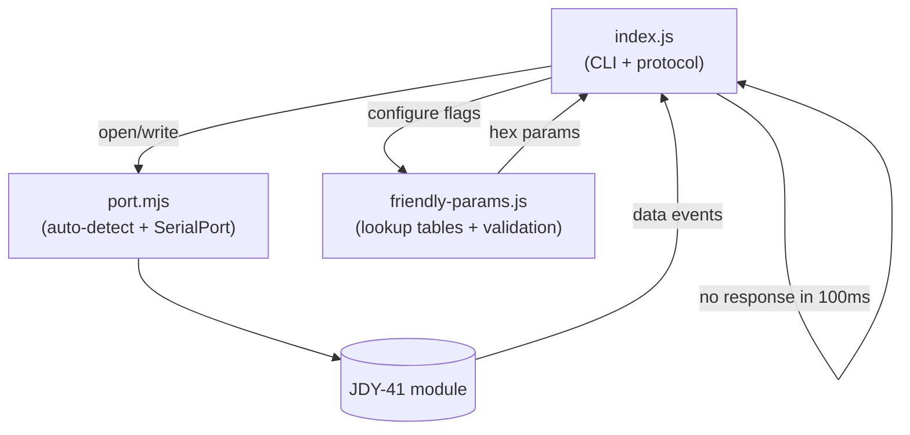

<p align="center">
  
</p>
<h1 align="center">JDY-41</h1>
<h2 align="center">Minimalistic CLI tool for module configuration</h2>

[](https://vshymanskyy.github.io/StandWithUkraine/)

## Why?
Configuration of <a href="./docs/jdy-41-manual.pdf">JDY-41</a> may be pretty challenging and requires special software for accessing the serial port. The purpose of this tool is to simplify and speed up the configuration process.

## Installation
1. Clone or download the repository.
2. Install dependencies via `npm i`.
   Requires Node.js 20+ (the project uses native ESM, top-level `await`, and `node:util`'s `parseArgs`).

## Architecture

`port.mjs` auto-detects the USB-serial device and exports a single `SerialPort` instance. `index.js` builds the hex instruction buffer for the given CLI command, writes it, and resends automatically if no response arrives within 100ms (the module ignores the first instruction after power-on). Incoming response bytes are accumulated until the `0D 0A` terminator is seen, then decoded either as an ASCII string (if the response starts with `+`) or as raw hex. `friendly-params.js` holds the lookup tables (baud rate, power, mode) and validation used by the `configure` command to translate human-readable flags into those hex parameter bytes.


```mermaid
graph TD
  CLI["index.js\n(CLI + protocol)"] -->|open/write| Port["port.mjs\n(auto-detect + SerialPort)"]
  CLI -->|configure flags| Friendly["friendly-params.js\n(lookup tables + validation)"]
  Friendly -->|hex params| CLI
  Port --> Device[("JDY-41 module")]
  Device -->|data events| CLI
  CLI -->|no response in 100ms| CLI
```

## Instructions
- `reset`
- `read-device-id`
- `read-version-number`
- `read-parameters`
- `configure-parameters` — raw hex params, see the [manual](./docs/jdy-41-manual.pdf) for the byte format
- `configure` — friendly flags, see [Configuring the module](#configuring-the-module) below
- `configure-device-id`
- `send-address-message`

## Features
- Automatic USB serial port detection.
- Resending the instruction if no response is received.
- No need to provide instruction's head and terminator.
- `configure` command accepts human-readable values (baud rate, power in db, mode name, etc.) instead of raw hex bytes.

## Notes
- After setting parameters module should be rebooted. Otherwise it will return old values when reading parameters.
- Module ignores first instruction after power on. This bug is handled by the tool.
- You can set custom baud rate and port path regex in the beginning of `port.mjs` file.

## Usage
```
npm start read-parameters
```

## Configuring the module

The `configure` command maps friendly flag values to the raw bytes `configure-parameters` expects, so you don't need to look them up in the [manual](./docs/jdy-41-manual.pdf) by hand:

```
npm start configure -- --baud 9600 --channel 5 --power 0db --mode transparent --id AABBCCDD --response no
```

> **Note:** the `--` before the flags is required — without it, `npm start` intercepts flags like `--help` itself instead of forwarding them to the script.

Run `npm start configure -- --help` for the full list of accepted values for each flag.

If you need a parameter combination the `configure` flags don't cover, fall back to `configure-parameters` with raw hex bytes as documented in the manual, e.g.:
```
npm start configure-parameters 04 00 09 A0 66 77 88 55 01 00
```
